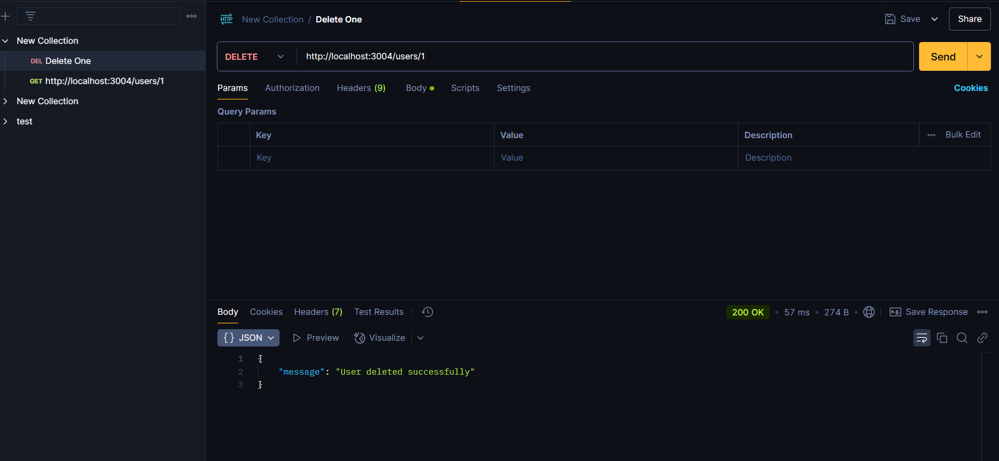

Get One Data

delete One Data (First data deleted succesfully.)

Get All Data Loaded Succesfully 

Put Data Created Succesfully

Data Created Succesfully

Withought error terminal

Mongodb Database
1) Commend Database 

2) Posts Database

3) Users Database

As Par Instruction Created 3 Seprate DB Connection